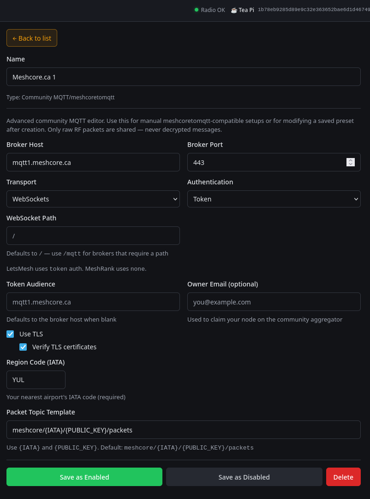

# Observe with RemoteTerm

[RemoteTerm for MeshCore](https://github.com/jkingsman/Remote-Terminal-for-MeshCore) can forward packet data from a radio it already manages. It does not decrypt private messages.

## Is this method right for you?

  
<strong>Use RemoteTerm if</strong>It already connects to the radio over serial, TCP, or BLE.

  
<strong>Use something else if</strong>You would install RemoteTerm only for observing.

  
<strong>Keep online</strong>The RemoteTerm host, radio connection, and internet access.

RemoteTerm changes quickly. If the labels do not match, check the upstream instructions for your installed version before saving.

## Before you start

- [ ] RemoteTerm is installed from its reviewed upstream source.
- [ ] The radio connection is stable.
- [ ] The radio is on the local mesh settings.
- [ ] You chose a real [location code](iata-codes.md).
- [ ] You read [Observer data, access, and privacy](data-collection-access.md).

## What this changes

You will add a primary and backup Community MQTT entry. They send packet data over encrypted WebSocket connections and do not change the radio firmware.

## Set up

Open **Settings** → **MQTT & Automation**, add **Community MQTT / meshcoretomqtt**, and enter:

| Field | Primary value |
|---|---|
| Name | `MeshCore.ca 1` |
| Broker Host | `mqtt1.meshcore.ca` |
| Broker Port | `443` |
| Transport | `WebSockets` |
| Authentication | `Token` |
| WebSocket Path | `/` |
| Token Audience | `mqtt1.meshcore.ca` |
| Use TLS | Enabled |
| Verify TLS certificates | Enabled |
| Region Code | Your nearest real three-letter location code |
| Packet Topic Template | `meshcore/{IATA}/{PUBLIC_KEY}/packets` |

Leave optional owner email blank unless it is operationally needed. Save the entry as enabled.

Add a backup entry with the same values, changing only:

| Field | Backup value |
|---|---|
| Name | `MeshCore.ca 2` |
| Broker Host | `mqtt2.meshcore.ca` |
| Token Audience | `mqtt2.meshcore.ca` |

Use the same location code in both entries.

!!! note "Windows MQTT fanout"
    If RemoteTerm's current upstream instructions require Uvicorn `--loop none` for Windows MQTT fanout, use that documented launch option. Confirm against the installed RemoteTerm version.

## What you should see

Both entries stay enabled without repeated TLS or token errors, and RemoteTerm's packet count changes when it hears nearby activity.

## Verify in CoreScope

1. Open [CoreScope Observers](https://live.meshcore.ca/#/observers) and find the RemoteTerm observer.
2. Create or wait for normal nearby activity.
3. Open [CoreScope Packets](https://live.meshcore.ca/#/packets) and confirm a recent packet appears.

Finish with [Check your observer](verify.md). A connected entry without a recent packet is not proof that the whole path works.

## Recovery

Disable or remove only the two Community MQTT entries you added. Do not remove unrelated RemoteTerm automation. Confirm RemoteTerm still manages the radio normally.

## If verification fails

Use [Troubleshooting](troubleshooting.md). If only the backup fails, check that its host and token audience are both `mqtt2.meshcore.ca`.
