# ON/QC region scopes proposal

<div class="scp-hero">
  <p class="mc-eyebrow">Proposal for discussion</p>
  <p class="mc-lede">Region scopes stop local chatter from flooding the whole network. Today's setup is hard to follow, so this proposal cuts it down to four levels of codes that everyone in Ontario and Québec can remember.</p>
  <ul class="scp-hero__badges">
    <li data-kind="proposal">Not adopted yet</li>
    <li>Ontario + Québec pilot</li>
    <li>Repeater firmware 1.16+ recommended</li>
    <li>MeshCore app 1.43+</li>
  </ul>
</div>

## What do I need to do?

| You… | What to do | When |
| --- | --- | --- |
| Use the MeshCore app with a companion radio | **Nothing yet.** Leave your settings as they are. [Phase 2](#phase-2-companion-setup) walks you through two settings, with screenshots. | January 2027 at the earliest |
| Own a repeater | Follow [Phase 1: Repeater setup](#phase-1-repeater-setup). | Now |
| Run a bot or MeshMapper | Scope it to your city, as described in [Bots and MeshMapper](#bots-and-meshmapper). | End of Phase 1, once the repeaters around you are set up |

Each phase is announced on the
[MeshCore Canada Discord](https://discord.gg/BESFVMt7yk). The rest of this page explains how it
all works. You don't need to understand it to follow the steps.

## The short version

There are four levels of scope. Every repeater carries one code from each: its city, its province, `onqc` and `can`. When you send a message, the scope decides how far it travels. `can` is reserved for later, so for now you only pick from the first three.

<div class="scp-levels-cards">
  <div class="scp-level-card" data-level="city">
    <h3>City</h3>
    <span class="scp-tag" data-level="city">yow</span> <span class="scp-tag" data-level="city">yul</span> <span class="scp-tag" data-level="city">yqb</span>
    <p>Your local area. Same codes as <a href="https://meshmapper.net/">MeshMapper</a>.</p>
  </div>
  <div class="scp-level-card" data-level="prov">
    <h3>Province</h3>
    <span class="scp-tag" data-level="prov">on</span> <span class="scp-tag" data-level="prov">qc</span>
    <p>Every repeater in that province.</p>
  </div>
  <div class="scp-level-card" data-level="mesh">
    <h3>Mesh</h3>
    <span class="scp-tag" data-level="mesh">onqc</span>
    <p>Every repeater in Ontario and Québec.</p>
  </div>
  <div class="scp-level-card" data-level="future">
    <h3>Canada</h3>
    <span class="scp-tag" data-level="future">can</span>
    <p>All of Canada. Reserved for later: carried now, not used yet.</p>
  </div>
</div>

Once every phase is done:

- **Repeaters** carry their city, their province, `onqc` and `can`.
- **Bots and MeshMapper** use their city, so they stay local.
- **Companions** use `onqc` as their default, so direct messages reach anyone.
- **`Public`** uses `onqc`, so everyone in Ontario and Québec can talk.
- **Test channels** use your city, so they stay local.
- **Messages with no scope** still work inside each city. Edge repeaters,
  the ones that regularly link different IATA regions, drop them so they stay local.

<div class="mc-callout" data-kind="warning" markdown>
Companions come last, in Phase 2. Setting a scope on your companion before
the repeaters around you are ready makes your messages reach **fewer**
people, not more.
</div>

### Words used on this page

- **Companion:** the MeshCore radio you pair with the app on your phone or
  computer.
- **Repeater:** a fixed radio, often on a roof or tower, that passes messages
  along.
- **Flood:** how a message spreads when it has no known route: every repeater
  that hears it passes it on. Channel messages always flood, and so does the
  first DM to someone.
- **Hop:** one repeater passing a message on.
- **DM:** a direct message to one contact.
- **Advert:** a radio announcing itself so others can find it.
- **Edge repeater:** a repeater that regularly talks to repeaters in two
  MeshMapper zones, for example both `yow` and `yul`.

## What a scope is

A scope is a short name attached to a message, such as `yow`. Repeaters use it
to decide whether to pass the message on.

<div class="mc-callout" markdown>
A scope is **not** encryption and **not** a GPS fence. Anyone who knows the
name can use it, and it has nothing to do with where you are. It is only a
label that says "repeaters that carry this name, please forward this."
</div>

Your app turns the name into a small code and puts it in the message header.
Every repeater keeps a list of names it will forward. When a message arrives,
the repeater checks the code against its list.

## How a repeater decides

<details class="scp-more" markdown>
<summary>Show the explanation</summary>

Here is an Ottawa repeater under this proposal, and what it does with five
different messages.

<figure class="scp-figure">
  <div class="scp-filter">
    <div class="scp-repeater">
      <svg class="scp-repeater__icon" viewBox="0 0 24 24" fill="none" stroke="currentColor" stroke-width="1.8" stroke-linecap="round" stroke-linejoin="round" aria-hidden="true"><path d="M12 10v11M8 21h8M9.5 21 12 10l2.5 11"/><circle cx="12" cy="8" r="1.6"/><path d="M8.6 4.6a5 5 0 0 0 0 6.8M15.4 4.6a5 5 0 0 1 0 6.8M6.2 2.4a8.3 8.3 0 0 0 0 11.2M17.8 2.4a8.3 8.3 0 0 1 0 11.2"/></svg>
      <p>Ottawa repeater</p>
      <div class="scp-repeater__list">
        <span class="scp-tag" data-level="any">*</span>
        <span class="scp-tag" data-level="city">yow</span>
        <span class="scp-tag" data-level="prov">on</span>
        <span class="scp-tag" data-level="mesh">onqc</span>
        <span class="scp-tag" data-level="future">can</span>
      </div>
      <small>Its list of names to forward</small>
    </div>
    <ul class="scp-checks">
      <li><span class="scp-packet"><span class="scp-tag" data-level="city">yow</span> Ottawa channel</span><span class="scp-checks__arrow" aria-hidden="true">→</span><span class="scp-result" data-result="ok">Forwarded</span></li>
      <li><span class="scp-packet"><span class="scp-tag" data-level="mesh">onqc</span> DM to Québec City, sent with the companion default</span><span class="scp-checks__arrow" aria-hidden="true">→</span><span class="scp-result" data-result="ok">Forwarded</span></li>
      <li><span class="scp-packet"><span class="scp-tag" data-level="any">none</span> Older app, no scope</span><span class="scp-checks__arrow" aria-hidden="true">→</span><span class="scp-result" data-result="ok">Forwarded</span></li>
      <li><span class="scp-packet"><span class="scp-tag" data-level="city">yul</span> Montréal channel</span><span class="scp-checks__arrow" aria-hidden="true">→</span><span class="scp-result" data-result="drop">Dropped</span></li>
      <li><span class="scp-packet"><span class="scp-tag" data-level="prov">qc</span> Québec-wide channel</span><span class="scp-checks__arrow" aria-hidden="true">→</span><span class="scp-result" data-result="drop">Dropped</span></li>
    </ul>
  </div>
  <div class="scp-rule">
    <div class="scp-rule__item" data-result="ok"><strong>Name is on the list:</strong> forward it.</div>
    <div class="scp-rule__item" data-result="drop"><strong>Name is not on the list:</strong> drop it.</div>
    <div class="scp-rule__item" data-result="ok"><strong>No scope at all:</strong> it counts as <code>*</code>. Forward it only if <code>*</code> is allowed.</div>
    <div class="scp-rule__item" data-result="drop"><strong>Too many hops:</strong> dropped once it passes <code>flood.max</code>, whatever its scope.</div>
  </div>
  <figcaption>The DM is tagged <code>onqc</code> because <code>onqc</code> is the companion default in this proposal. <a href="#why-the-companion-default-is-onqc">See why further down</a>. The repeater still hears every message. A scope only decides whether it passes the message on. Your companion also receives everything that reaches it.</figcaption>
</figure>

Four details catch people out:

- **Spelling must be exact.** `yow`, `YOW` and `ott` are three different
  names. A companion set to `yow` is ignored by a repeater that only carries `ott`.
- **Only floods are checked.** Once a direct message has a known path, it goes
  straight along that path and scopes no longer matter.
- **There is no inheritance.** Carrying `on` does not mean carrying `yow`.
  Each name has to be on the list by itself.
- **A repeater with no regions set drops every scoped message.** Out of the
  box, a repeater only carries `*`, so it forwards messages with no scope and
  nothing else. Scoped messages only work once the repeaters along the way are
  set up.

</details>


## The four levels

<figure class="scp-figure">
  <div class="scp-zone" data-level="future">
  <p class="scp-zone__title"><span class="scp-tag" data-level="future">can</span> Canada <span>Reserved for later. Carried now, not used yet.</span></p>
  <div class="scp-zone" data-level="mesh">
    <p class="scp-zone__title"><span class="scp-tag" data-level="mesh">onqc</span> Mesh <span>Every repeater in Ontario and Québec</span></p>
    <div class="scp-zone__row">
      <div class="scp-zone" data-level="prov">
        <p class="scp-zone__title"><span class="scp-tag" data-level="prov">on</span> Ontario</p>
        <div class="scp-cities">
          <div class="scp-city"><strong>yow</strong><span>Ottawa, Lanark, Calabogie, Renfrew, Alfred, Hawkesbury</span></div>
          <div class="scp-city"><strong>yyz</strong><span>Toronto</span></div>
          <div class="scp-city"><strong>ygk</strong><span>Kingston</span></div>
          <div class="scp-city"><strong>ykf</strong><span>Waterloo</span></div>
          <div class="scp-city" data-more><strong>…</strong><span>Other MeshMapper zones</span></div>
        </div>
      </div>
      <div class="scp-zone" data-level="prov">
        <p class="scp-zone__title"><span class="scp-tag" data-level="prov">qc</span> Québec</p>
        <div class="scp-cities">
          <div class="scp-city"><strong>yul</strong><span>Montréal, Trois-Rivières</span></div>
          <div class="scp-city"><strong>yqb</strong><span>Québec City</span></div>
          <div class="scp-city"><strong>yow</strong><span>Gatineau, Rigaud (shared with Ottawa)</span></div>
          <div class="scp-city"><strong>ytf</strong><span>Saguenay–Lac-Saint-Jean</span></div>
          <div class="scp-city" data-more><strong>…</strong><span>Other MeshMapper zones</span></div>
        </div>
      </div>
    </div>
  </div>
  </div>
  <div class="scp-flat">
    <strong>What an Ottawa repeater actually stores:</strong>
    <span class="scp-flat__list"><span class="scp-tag" data-level="any">*</span><span class="scp-tag" data-level="city">yow</span><span class="scp-tag" data-level="prov">on</span><span class="scp-tag" data-level="mesh">onqc</span><span class="scp-tag" data-level="future">can</span></span>
    <span>A flat list of names. The boxes above are for people, not for the repeater.</span>
  </div>
  <figcaption>The <code>yow</code> zone crosses the Ottawa River. Gatineau repeaters use <code>yow</code> for their city and <code>qc</code> for their province.</figcaption>
</figure>

### What about `can`?

Every repeater carries `can` now so that a Canada-wide scope works later
without anyone having to reconfigure their repeater again. Many repeaters set
up with the current configurator already carry it.

**Don't use `can` on your companion or channels yet.** Today it reaches the same
repeaters as `onqc`. Keep using `onqc`. Once other provinces carry `can` too,
it becomes the way to reach further, and `onqc` stays as "just the Ontario and
Québec mesh".

### Why airport codes?

<details class="scp-more" markdown>
<summary>Show the explanation</summary>

- They are the same codes MeshMapper already uses, for example
  `yow.meshmapper.net`.
- MeshCore already uses airport codes elsewhere, such as the
  [location code every observer reports](../analyzer/iata-codes.md). They are
  not a perfect fit for mesh areas, but that is not going to change, and a
  second set of names just for regions would only add confusion over time.
- There are no accents or capital letters to get wrong. `montréal`,
  `Montreal` and `montreal` would be three different scopes.
- They are easy to split later. If Renfrew wants its own area one day, it can
  use its own airport code and still keep `on` and `onqc`. Nothing else changes.

Always write the code with its area the first time, for example
`yow` (Ottawa / NCR area), so people learn it.

</details>


## Reading `region def yow|* on|* onqc|* can`

This section is for repeater owners who want to understand the command. You
can skip it: step 4 of Phase 1 gives you the exact commands to type.

<details class="scp-more" markdown>
<summary>Show how the command works</summary>

`region def` builds a repeater's list in one line. It keeps a **cursor** that
starts at the top, `*`. Each name is created under the cursor, and `|*` jumps
the cursor back to the top.

<figure class="scp-figure">
  <div class="scp-tape" aria-label="region def yow|* on|* onqc|* can">
    <span class="scp-tape__cmd">region def</span>
    <span class="scp-tape__tok"><b>1</b>yow</span>
    <span class="scp-tape__tok" data-kind="jump"><b>2</b>|*</span>
    <span class="scp-tape__tok"><b>3</b>on</span>
    <span class="scp-tape__tok" data-kind="jump"><b>4</b>|*</span>
    <span class="scp-tape__tok"><b>5</b>onqc</span>
    <span class="scp-tape__tok" data-kind="jump"><b>6</b>|*</span>
    <span class="scp-tape__tok"><b>7</b>can</span>
  </div>
  <ol class="scp-steps">
    <li>Create <code>yow</code> under the cursor. The cursor moves into <code>yow</code>.<div class="scp-tree">*
└ <mark>yow</mark></div></li>
    <li><code>|*</code> jumps the cursor back to the top.<div class="scp-tree"><mark>*</mark>
└ yow</div></li>
    <li>Create <code>on</code> under the cursor. The cursor moves into <code>on</code>.<div class="scp-tree">*
├ yow
└ <mark>on</mark></div></li>
    <li><code>|*</code> jumps back to the top again.<div class="scp-tree"><mark>*</mark>
├ yow
└ on</div></li>
    <li>Create <code>onqc</code>.<div class="scp-tree">*
├ yow
├ on
└ <mark>onqc</mark></div></li>
    <li><code>|*</code> back to the top.<div class="scp-tree"><mark>*</mark>
├ yow
├ on
└ onqc</div></li>
    <li>Create <code>can</code>. Done.<div class="scp-tree">*
├ yow
├ on
├ onqc
└ <mark>can</mark></div></li>
  </ol>
  <figcaption>The result is a flat list: every code sits side by side under <code>*</code>. The highlighted name is where the cursor is.</figcaption>
</figure>

<div class="mc-callout" data-kind="warning" markdown>
`region def` only adds or moves names. It never deletes the ones already
there. Run `region` afterwards to see the full list.
</div>

</details>


## Rollout order

Do this in order. Each phase starts only once the one before it is done, and
is announced on Discord. **Don't change your companion settings
yet.** Phase 2 is not open.

<ol class="scp-timeline">
  <li data-phase="Phase 1"><h3>Repeaters</h3><p>Now. Owners clear old regions and add their codes. City repeaters keep <code>*</code> allowed; edge repeaters drop it. Near the end, bots and MeshMapper are scoped to their city. Test local messaging after the change.</p></li>
  <li data-phase="Phase 2"><h3>Companions</h3><p>January 2027 at the earliest, once the repeaters around them are set up. Users set their default and <code>Public</code> to <code>onqc</code>, and test channels to their city.</p></li>
  <li data-phase="Phase 3"><h3>Only if needed</h3><p>If messages with no scope are still too noisy inside a city, repeaters can also run <code>set flood.max.unscoped 3</code>. Scoped messages still reach 16 hops.</p></li>
</ol>

## Phase 1: Repeater setup

Phase 1 has three goals:

1. **Get the new region config on every repeater**, so each one carries its
   city, its province, `onqc` and `can`.
2. **Limit unscoped traffic between cities.** Edge repeaters drop messages
   with no scope, so local chatter stays in its own city.
3. **Near the end, scope bots and MeshMapper to their city**, once the
   repeaters around them carry the city code. See
   [Bots and MeshMapper](#bots-and-meshmapper).

Companions don't change anything in this phase. If you only use the app,
there is nothing for you to do here.

Type these into the repeater's command line **one command at a time**: in the
MeshCore app, open the repeater, log in as admin and use the command box in
**Repeater Admin**, or use the USB console. Each command has its own copy
button. Wait for `OK` before sending the next one.

<div class="scp-shots" markdown>

<figure class="scp-shot" markdown>
[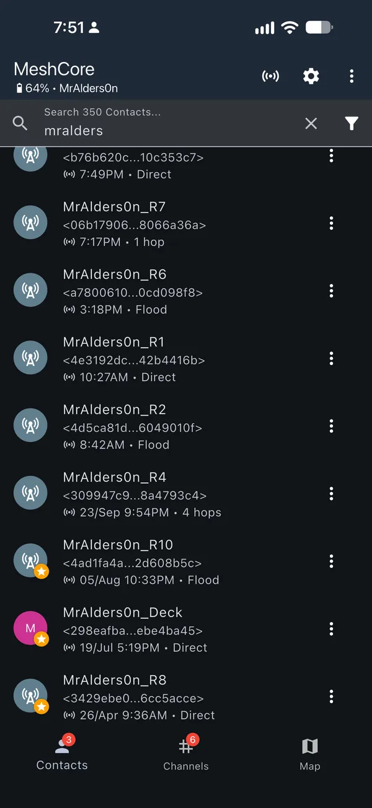{ loading=lazy width="600" height="1304" }](../assets/images/onqc-scopes/repeater-01-contacts.webp)
<figcaption markdown="span"><span class="scp-shot__num">1</span> In <strong>Contacts</strong>, find your repeater (search by name) and tap it.</figcaption>
</figure>

<figure class="scp-shot" markdown>
[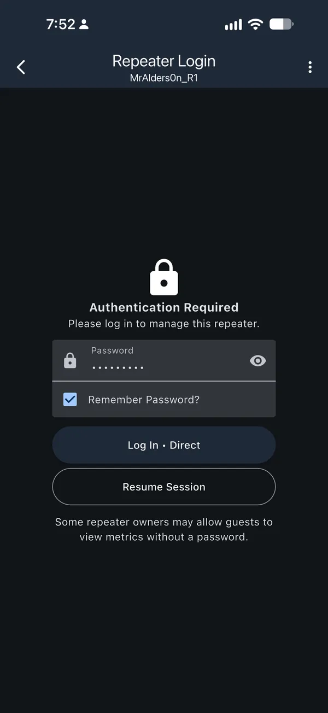{ loading=lazy width="600" height="1304" }](../assets/images/onqc-scopes/repeater-02-login.webp)
<figcaption markdown="span"><span class="scp-shot__num">2</span> Enter the admin password and tap <strong>Log In</strong>.</figcaption>
</figure>

<figure class="scp-shot" markdown>
[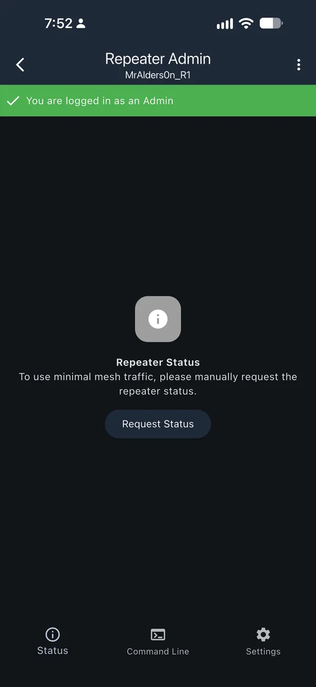{ loading=lazy width="600" height="1304" }](../assets/images/onqc-scopes/repeater-03-admin.webp)
<figcaption markdown="span"><span class="scp-shot__num">3</span> Check for <strong>You are logged in as an Admin</strong>, then tap <strong>Command Line</strong> at the bottom.</figcaption>
</figure>

</div>

<div class="mc-callout" markdown>
**Tip:** every command should get a reply, usually `OK`. If nothing comes back
after a few seconds, send it again: tap and hold the command and choose
**Send Again**. Sending a command twice is safe.
</div>

### Step 1: Check your firmware and describe your repeater

<div class="scp-card">
<ol class="scp-cmds"><li class="scp-cmd"><code>ver</code><button type="button" class="scp-copy" title="Copy" aria-label="Copy: ver"><svg viewBox="0 0 24 24" aria-hidden="true"><path fill="currentColor" d="M19 21H8V7h11m0-2H8a2 2 0 0 0-2 2v14a2 2 0 0 0 2 2h11a2 2 0 0 0 2-2V7a2 2 0 0 0-2-2m-3-4H4a2 2 0 0 0-2 2v14h2V3h12z"/></svg></button></li></ol>
</div>

<div class="scp-shots" markdown>

<figure class="scp-shot" markdown>
[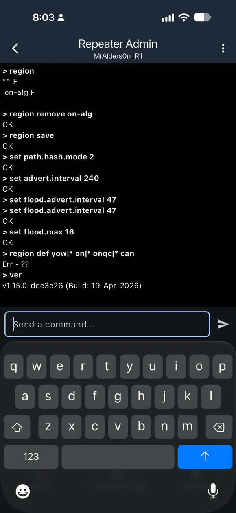{ loading=lazy width="600" height="1304" }](../assets/images/onqc-scopes/repeater-05-ver.webp)
<figcaption markdown="span"><span class="scp-shot__num">1</span> Type <code>ver</code> and tap send. The firmware version appears underneath, for example <code>v1.15.0</code>.</figcaption>
</figure>

</div>

Then tell us about your repeater. Steps 3 and 4 show the right commands for
it. Your area is your **MeshMapper zone**: open [MeshMapper](https://meshmapper.net/)
and find the zone your repeater sits in. These zones follow the MeshMapper
boundaries that already exist. They are not perfect, but they are how most
people already see the map today, so there is nothing new to learn.

<div class="scp-picker" data-scp-picker data-copy-label="Copy" data-copied-label="Copied" hidden>
  <label class="scp-picker__field"><span>Area</span><select data-scp-area><option value="ottawa" data-city="yow" data-province="on">Ottawa and surrounding areas</option><option value="gatineau" data-city="yow" data-province="qc">Gatineau</option><option value="montreal" data-city="yul" data-province="qc">Montréal and surrounding areas</option><option value="quebec" data-city="yqb" data-province="qc">Québec City</option></select></label>
  <label class="scp-picker__field"><span>Firmware</span><select data-scp-firmware><option value="116">1.16 or newer</option><option value="115">1.15</option><option value="114">1.14</option><option value="110">1.10 to 1.13</option></select></label>
  <label class="scp-picker__field"><span>Repeater type</span><select data-scp-type><option value="city">City repeater</option><option value="edge">Edge repeater</option></select><small class="scp-picker__hint">Pick edge only if it regularly talks to repeaters in another MeshMapper zone.</small></label>
  <label class="scp-picker__field" data-scp-extra-field hidden><span>Neighbouring city (optional)</span><select data-scp-extra><option value="">None</option><option value="yow">Ottawa / Gatineau (yow)</option><option value="yul">Montréal (yul)</option><option value="yqb">Québec City (yqb)</option></select></label>
</div>

<div class="mc-callout" markdown>
**City or edge?** An edge repeater regularly talks to repeaters in **two
MeshMapper zones**, for example both `yow` and `yul`. Every other repeater is
a city repeater, including one on the outer edge of its zone: if nothing on
the other side connects to it, it is a city repeater. If it starts linking to
another zone regularly, switch it to edge.

Different cities or map outlines with the same IATA code still count as one
region. Ottawa and Gatineau, for example, both use `yow`.
</div>

**Not sure? Check the map.** Open [this MeshMapper view](https://onqc.meshmapper.net/?preset=all&lat=45.21108&lon=-75.44812&zoom=9.61&m=dark&l=rep.nbr.nz.nzb.rb&cm=std). It
shows zone boundaries and repeater neighbours on a dark map, so the borders
are easy to see. Click your repeater to see its neighbours. For each one, the
map shows how many packets have been seen on that link and when it was last
seen. If several neighbours are outside your MeshMapper zone and those links
are used often and recently, make it an edge repeater. A single link seen a
few times, or not for weeks, doesn't count.


### Step 2: Clear any old regions

The new commands don't delete regions that are already on the repeater. To
avoid conflicts, remove any old ones first. Start by listing what is there:

<div class="scp-card">
<ol class="scp-cmds"><li class="scp-cmd"><code>region</code><button type="button" class="scp-copy" title="Copy" aria-label="Copy: region"><svg viewBox="0 0 24 24" aria-hidden="true"><path fill="currentColor" d="M19 21H8V7h11m0-2H8a2 2 0 0 0-2 2v14a2 2 0 0 0 2 2h11a2 2 0 0 0 2-2V7a2 2 0 0 0-2-2m-3-4H4a2 2 0 0 0-2 2v14h2V3h12z"/></svg></button></li></ol>
</div>

<div class="scp-ask" data-scp-ask hidden>
<p class="scp-ask__q">Does the reply list any names other than <code>*</code>?</p>
<div class="scp-ask__choices" role="group" aria-label="Does the reply list any names other than *?">
<button type="button" class="scp-choice" data-scp-choice="old" aria-pressed="false">Yes, other names</button>
<button type="button" class="scp-choice" data-scp-choice="clean" aria-pressed="false">No, only <code>*^ F</code></button>
</div>
</div>

<div data-scp-ask-nojs markdown>

Then check the reply:

- **Only `*^ F`:** the repeater has no old regions. Nothing to clear, go to
  [step 3](#step-3-standard-meshcore-canada-settings).
- **Other names as well**, such as `can`, `on-alg` or `ott`: remove them as
  shown below.

</div>

<div class="scp-branch" data-scp-branch="clean" hidden markdown>

**Nothing to clear.** Your repeater has no old regions. Go straight to
[step 3](#step-3-standard-meshcore-canada-settings).

</div>

<div class="scp-branch" data-scp-branch="old" markdown>

Remove each name except `*` with `region remove <name>`, one at a time,
starting with the most indented line. Then run `region save`, and `region`
again to check. For example, the old Ottawa layout:

<div class="scp-card">
<p class="scp-variant__label">Example: the old Ottawa layout</p>
<ol class="scp-cmds"><li class="scp-cmd"><code>region remove ott</code><button type="button" class="scp-copy" title="Copy" aria-label="Copy: region remove ott"><svg viewBox="0 0 24 24" aria-hidden="true"><path fill="currentColor" d="M19 21H8V7h11m0-2H8a2 2 0 0 0-2 2v14a2 2 0 0 0 2 2h11a2 2 0 0 0 2-2V7a2 2 0 0 0-2-2m-3-4H4a2 2 0 0 0-2 2v14h2V3h12z"/></svg></button></li><li class="scp-cmd"><code>region remove on-alg</code><button type="button" class="scp-copy" title="Copy" aria-label="Copy: region remove on-alg"><svg viewBox="0 0 24 24" aria-hidden="true"><path fill="currentColor" d="M19 21H8V7h11m0-2H8a2 2 0 0 0-2 2v14a2 2 0 0 0 2 2h11a2 2 0 0 0 2-2V7a2 2 0 0 0-2-2m-3-4H4a2 2 0 0 0-2 2v14h2V3h12z"/></svg></button></li><li class="scp-cmd"><code>region remove on</code><button type="button" class="scp-copy" title="Copy" aria-label="Copy: region remove on"><svg viewBox="0 0 24 24" aria-hidden="true"><path fill="currentColor" d="M19 21H8V7h11m0-2H8a2 2 0 0 0-2 2v14a2 2 0 0 0 2 2h11a2 2 0 0 0 2-2V7a2 2 0 0 0-2-2m-3-4H4a2 2 0 0 0-2 2v14h2V3h12z"/></svg></button></li><li class="scp-cmd"><code>region remove can</code><button type="button" class="scp-copy" title="Copy" aria-label="Copy: region remove can"><svg viewBox="0 0 24 24" aria-hidden="true"><path fill="currentColor" d="M19 21H8V7h11m0-2H8a2 2 0 0 0-2 2v14a2 2 0 0 0 2 2h11a2 2 0 0 0 2-2V7a2 2 0 0 0-2-2m-3-4H4a2 2 0 0 0-2 2v14h2V3h12z"/></svg></button></li><li class="scp-cmd"><code>region save</code><button type="button" class="scp-copy" title="Copy" aria-label="Copy: region save"><svg viewBox="0 0 24 24" aria-hidden="true"><path fill="currentColor" d="M19 21H8V7h11m0-2H8a2 2 0 0 0-2 2v14a2 2 0 0 0 2 2h11a2 2 0 0 0 2-2V7a2 2 0 0 0-2-2m-3-4H4a2 2 0 0 0-2 2v14h2V3h12z"/></svg></button></li><li class="scp-cmd"><code>region</code><button type="button" class="scp-copy" title="Copy" aria-label="Copy: region"><svg viewBox="0 0 24 24" aria-hidden="true"><path fill="currentColor" d="M19 21H8V7h11m0-2H8a2 2 0 0 0-2 2v14a2 2 0 0 0 2 2h11a2 2 0 0 0 2-2V7a2 2 0 0 0-2-2m-3-4H4a2 2 0 0 0-2 2v14h2V3h12z"/></svg></button></li></ol>
</div>

If a `region remove` answers with an error:

- **`Err - not empty`:** another name is still indented under it. Remove that
  one first, then try again.
- **`Err - not found`:** that name is already gone. That is fine, carry on.

Removing `on` and `can` is fine too. Step 4 adds them back. When you are done,
`region` should show only `*^ F`.

<div class="scp-shots" markdown>

<figure class="scp-shot" markdown>
[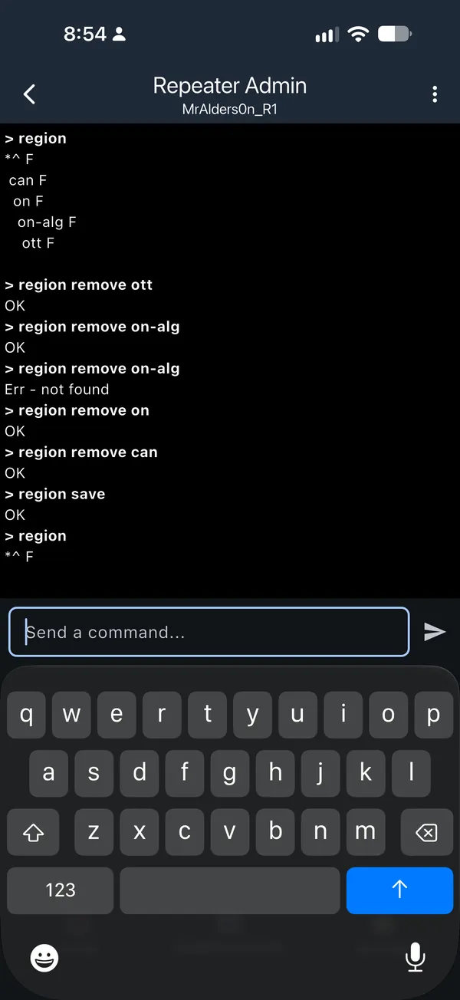{ loading=lazy width="600" height="1304" }](../assets/images/onqc-scopes/repeater-clear-old.webp)
<figcaption markdown="span"><span class="scp-shot__num">1</span> The old Ottawa layout, removed from the bottom up. Removing something twice just answers <code>Err - not found</code>. That is fine.</figcaption>
</figure>

</div>

</div>

### Step 3: Standard MeshCore Canada settings

<div class="scp-card">
<p class="scp-variant__label" data-scp-summary>Ottawa and surrounding areas · 1.16 or newer · City repeater</p>
<ol class="scp-cmds" data-scp-output="standard"><li class="scp-cmd"><code>set path.hash.mode 2</code><button type="button" class="scp-copy" title="Copy" aria-label="Copy: set path.hash.mode 2"><svg viewBox="0 0 24 24" aria-hidden="true"><path fill="currentColor" d="M19 21H8V7h11m0-2H8a2 2 0 0 0-2 2v14a2 2 0 0 0 2 2h11a2 2 0 0 0 2-2V7a2 2 0 0 0-2-2m-3-4H4a2 2 0 0 0-2 2v14h2V3h12z"/></svg></button></li><li class="scp-cmd"><code>set advert.interval 240</code><button type="button" class="scp-copy" title="Copy" aria-label="Copy: set advert.interval 240"><svg viewBox="0 0 24 24" aria-hidden="true"><path fill="currentColor" d="M19 21H8V7h11m0-2H8a2 2 0 0 0-2 2v14a2 2 0 0 0 2 2h11a2 2 0 0 0 2-2V7a2 2 0 0 0-2-2m-3-4H4a2 2 0 0 0-2 2v14h2V3h12z"/></svg></button></li><li class="scp-cmd"><code>set flood.advert.interval 47</code><button type="button" class="scp-copy" title="Copy" aria-label="Copy: set flood.advert.interval 47"><svg viewBox="0 0 24 24" aria-hidden="true"><path fill="currentColor" d="M19 21H8V7h11m0-2H8a2 2 0 0 0-2 2v14a2 2 0 0 0 2 2h11a2 2 0 0 0 2-2V7a2 2 0 0 0-2-2m-3-4H4a2 2 0 0 0-2 2v14h2V3h12z"/></svg></button></li><li class="scp-cmd"><code>set flood.max 16</code><button type="button" class="scp-copy" title="Copy" aria-label="Copy: set flood.max 16"><svg viewBox="0 0 24 24" aria-hidden="true"><path fill="currentColor" d="M19 21H8V7h11m0-2H8a2 2 0 0 0-2 2v14a2 2 0 0 0 2 2h11a2 2 0 0 0 2-2V7a2 2 0 0 0-2-2m-3-4H4a2 2 0 0 0-2 2v14h2V3h12z"/></svg></button></li></ol>
<p class="scp-note scp-note--info" data-scp-note="no-hash" hidden><code>set path.hash.mode 2</code> is left out: it needs firmware 1.14 or newer.</p>
<p class="scp-note" data-scp-nojs>These commands are for an Ottawa-area city repeater on firmware 1.16 or newer. Turn on JavaScript to match them to your repeater.</p>
</div>

<details class="scp-more" markdown>
<summary>What do these commands do?</summary>

<dl class="scp-explain">
  <dt>path.hash.mode 2</dt><dd>Uses 3-byte repeater IDs in message paths, so fewer repeaters share an ID. Needs firmware 1.14 or newer.</dd>
  <dt>advert.interval 240</dt><dd>Announces this repeater to direct neighbours every 4 hours.</dd>
  <dt>flood.advert.interval 47</dt><dd>Announces this repeater across the network every 47 hours.</dd>
  <dt>flood.max 16</dt><dd>No flood message travels more than 16 hops, scoped or not.</dd>
</dl>

</details>

These save by themselves. No `region save` is needed for them. If a command
answers `Err - ??`, your firmware does not have that setting, so skip it.

<div class="scp-shots" markdown>

<figure class="scp-shot" markdown>
[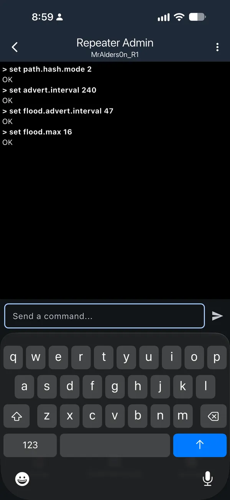{ loading=lazy width="600" height="1304" }](../assets/images/onqc-scopes/repeater-standard-settings.webp)
<figcaption markdown="span"><span class="scp-shot__num">1</span> Each setting answers <code>OK</code>.</figcaption>
</figure>

</div>

### Step 4: Region settings

These follow your answers in step 1. Run them in order.

<div class="scp-card">
<p class="scp-variant__label" data-scp-summary>Ottawa and surrounding areas · 1.16 or newer · City repeater</p>
<ol class="scp-cmds" data-scp-output="region"><li class="scp-cmd"><code>region def yow|* on|* onqc|* can</code><button type="button" class="scp-copy" title="Copy" aria-label="Copy: region def yow|* on|* onqc|* can"><svg viewBox="0 0 24 24" aria-hidden="true"><path fill="currentColor" d="M19 21H8V7h11m0-2H8a2 2 0 0 0-2 2v14a2 2 0 0 0 2 2h11a2 2 0 0 0 2-2V7a2 2 0 0 0-2-2m-3-4H4a2 2 0 0 0-2 2v14h2V3h12z"/></svg></button></li><li class="scp-cmd"><code>region allowf *</code><button type="button" class="scp-copy" title="Copy" aria-label="Copy: region allowf *"><svg viewBox="0 0 24 24" aria-hidden="true"><path fill="currentColor" d="M19 21H8V7h11m0-2H8a2 2 0 0 0-2 2v14a2 2 0 0 0 2 2h11a2 2 0 0 0 2-2V7a2 2 0 0 0-2-2m-3-4H4a2 2 0 0 0-2 2v14h2V3h12z"/></svg></button></li><li class="scp-cmd"><code>region default yow</code><button type="button" class="scp-copy" title="Copy" aria-label="Copy: region default yow"><svg viewBox="0 0 24 24" aria-hidden="true"><path fill="currentColor" d="M19 21H8V7h11m0-2H8a2 2 0 0 0-2 2v14a2 2 0 0 0 2 2h11a2 2 0 0 0 2-2V7a2 2 0 0 0-2-2m-3-4H4a2 2 0 0 0-2 2v14h2V3h12z"/></svg></button></li><li class="scp-cmd"><code>region save</code><button type="button" class="scp-copy" title="Copy" aria-label="Copy: region save"><svg viewBox="0 0 24 24" aria-hidden="true"><path fill="currentColor" d="M19 21H8V7h11m0-2H8a2 2 0 0 0-2 2v14a2 2 0 0 0 2 2h11a2 2 0 0 0 2-2V7a2 2 0 0 0-2-2m-3-4H4a2 2 0 0 0-2 2v14h2V3h12z"/></svg></button></li></ol>
<p class="scp-note scp-note--info" data-scp-note="fw-116" hidden><code>region def</code> answers with the finished list, so you can see straight away that it worked.</p>
<p class="scp-note scp-note--info" data-scp-note="fw-115" hidden>Each <code>region put</code> answers <code>OK - (flood allowed)</code>, and <code>region default</code> answers <code>default scope is now …</code>.</p>
<p class="scp-note scp-note--info" data-scp-note="fw-put-allow" hidden>On this firmware a new region starts with forwarding <strong>off</strong>, so each one also needs <code>region allowf</code>. There is no <code>region default</code>, so this repeater's own adverts stay unscoped. Updating the firmware is worth it.</p>
<p class="scp-note" data-scp-note="edge" hidden><strong>Edge repeater:</strong> drops messages with no scope, so they do not flood the next city. Use it for any repeater that regularly talks to repeaters in two MeshMapper zones, such as Rigaud, which links <code>yow</code> and <code>yul</code>. Otherwise, messages with no scope leak through it. Nearby people without a scope are not relayed by it, so avoid it where it is the only repeater. See <a href="#who-hears-what">Who hears what</a>.</p>
<p class="scp-note" data-scp-note="extra" hidden><strong>Neighbouring city:</strong> this only helps people near this repeater take part in that city's channels. Everyone else reaches the other city through <code>onqc</code>. Rigaud, for example, carries <code>yul</code> as well as <code>yow</code>.</p>
<p class="scp-note" data-scp-nojs>These commands are for an Ottawa-area city repeater on firmware 1.16 or newer. Turn on JavaScript to match them to your repeater.</p>
</div>

<details class="scp-more" markdown>
<summary>What do these commands do?</summary>

<dl class="scp-explain">
  <dt>region def / region put</dt><dd>Carry your city, your province, <code>onqc</code> and <code>can</code>.</dd>
  <dt>region allowf * / region denyf *</dt><dd>City repeaters forward messages with <strong>no scope</strong> (on by default, set so you can see it). Edge repeaters drop them.</dd>
  <dt>region default &lt;city&gt;</dt><dd>This repeater's own adverts use your city's scope, so they stay local. Not available before 1.15.</dd>
  <dt>region save</dt><dd>Keeps the region settings after a reboot.</dd>
</dl>

</details>

<div class="scp-shots" markdown>

<figure class="scp-shot" markdown>
[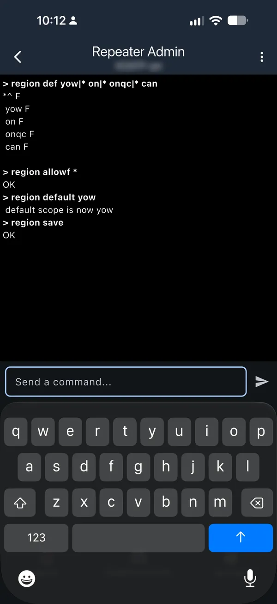{ loading=lazy width="600" height="1304" }](../assets/images/onqc-scopes/repeater-region-def-116.webp)
<figcaption markdown="span"><span class="scp-shot__num">1</span> Firmware 1.16 or newer: <code>region def</code> answers with the finished list.</figcaption>
</figure>

<figure class="scp-shot" markdown>
[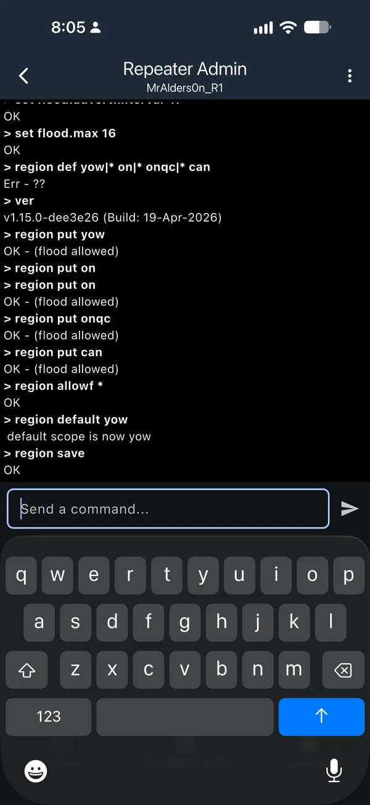{ loading=lazy width="600" height="1304" }](../assets/images/onqc-scopes/repeater-07-region-put-115.webp)
<figcaption markdown="span"><span class="scp-shot__num">2</span> Firmware 1.15: each <code>region put</code> answers <code>OK - (flood allowed)</code>.</figcaption>
</figure>

</div>

### Step 5: Check the result

<div class="scp-card">
<ol class="scp-cmds"><li class="scp-cmd"><code>region</code><button type="button" class="scp-copy" title="Copy" aria-label="Copy: region"><svg viewBox="0 0 24 24" aria-hidden="true"><path fill="currentColor" d="M19 21H8V7h11m0-2H8a2 2 0 0 0-2 2v14a2 2 0 0 0 2 2h11a2 2 0 0 0 2-2V7a2 2 0 0 0-2-2m-3-4H4a2 2 0 0 0-2 2v14h2V3h12z"/></svg></button></li></ol>
</div>

For Ottawa, you should see:

```text
*^ F
 yow F
 on F
 onqc F
 can F
```

`F` means "flood allowed": the repeater forwards that name. The `^` next to
`*` marks the repeater's home region; with none set, it sits on `*`. You can
ignore it.

<div class="scp-shots" markdown>

<figure class="scp-shot" markdown>
[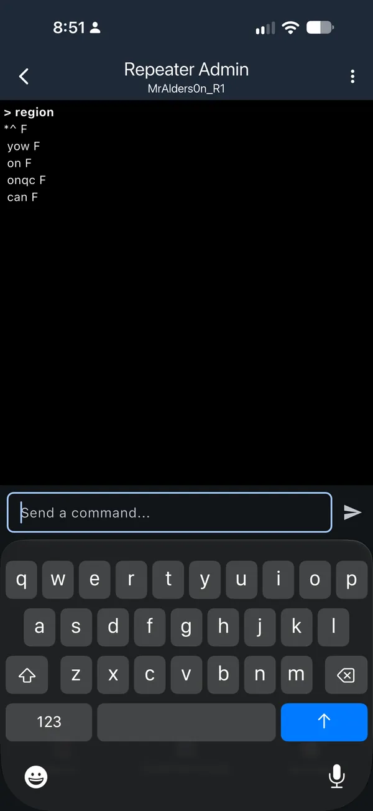{ loading=lazy width="600" height="1304" }](../assets/images/onqc-scopes/repeater-08-region-result.webp)
<figcaption markdown="span"><span class="scp-shot__num">1</span> The finished list on an Ottawa repeater.</figcaption>
</figure>

</div>

### Allow or drop, quick reference

<details class="scp-more" markdown>
<summary>Show the quick reference</summary>

| Command | What it does |
| --- | --- |
| `region allowf <name>` | Forward messages with that name |
| `region denyf <name>` | Drop messages with that name. The repeater still receives them itself. |
| `<name>` | Can be `*` for messages with no scope, or a code such as `yow` |
| `set flood.max.unscoped <hops>` | A separate hop limit for messages with no scope. It only matters when it is lower than `flood.max`. `0` has the same effect as `region denyf *`. |
| `region save` | Always run it after `allowf` or `denyf` |

</details>


### Bots and MeshMapper

This comes at the end of Phase 1, once the repeaters around you carry your
city code. Scoping bots and MeshMapper to your city keeps their traffic out
of other cities.

- **Bots:** on the companion the bot uses, set **Default Region Scope** to
  your city code, for example `yow`. The steps are the same as
  [Phase 2, step 1](#step-1-set-your-default-scope), with your city code
  instead of `onqc`. Set any channel the bot posts in to your city as well.
- **MeshMapper:** use your city code as the scope for its messages.

## Phase 2: Companion setup

<div class="mc-callout" data-kind="warning" markdown>
**Not yet. The earliest this should be considered is January 2027.** Phase 1
has to be finished first. A repeater with no regions set drops every scoped
message. If you set your default to `onqc` before the repeaters on your routes
carry it, your channel messages and first DMs will only reach nearby. Until
Phase 2 is announced, leave **Default Region Scope** empty and your channels
unscoped. You will still receive everything.
</div>

When Phase 2 opens, this is all you need to do: set a default scope, then set
a scope on a few channels. It takes about five minutes in the MeshCore app.

### Step 1: Set your default scope

In the MeshCore app, open **Settings**. Under **Network Settings**, tap
**Default Region Scope**, add `onqc` and select it.

<div class="scp-shots" markdown>

<figure class="scp-shot" markdown>
[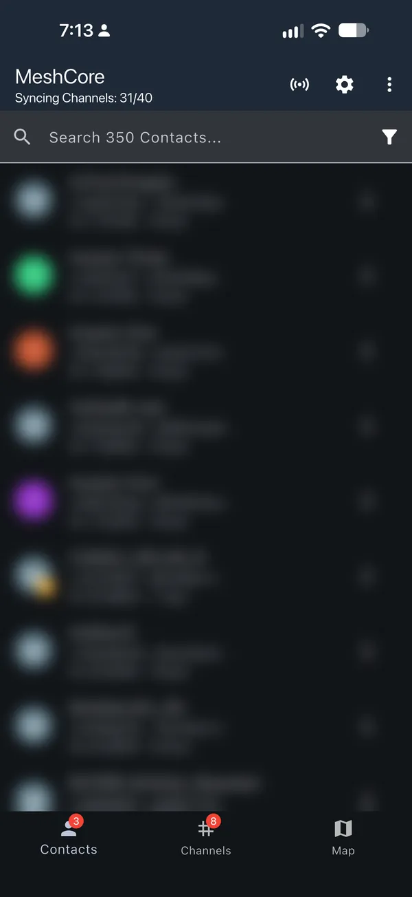{ loading=lazy width="600" height="1304" }](../assets/images/onqc-scopes/companion-01-connected.webp)
<figcaption markdown="span"><span class="scp-shot__num">1</span> Connect your companion to the MeshCore app and tap the <strong>settings cog</strong> in the top right.</figcaption>
</figure>

<figure class="scp-shot" markdown>
[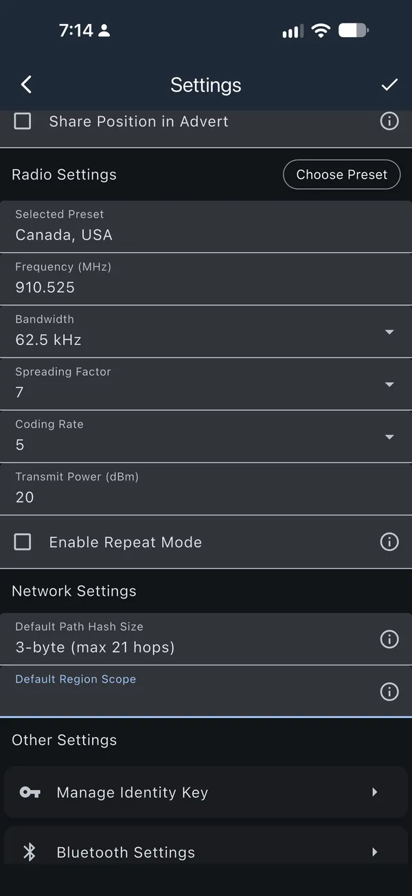{ loading=lazy width="600" height="1304" }](../assets/images/onqc-scopes/companion-02-settings.webp)
<figcaption markdown="span"><span class="scp-shot__num">2</span> Scroll down to <strong>Network Settings</strong> and tap <strong>Default Region Scope</strong>.</figcaption>
</figure>

<figure class="scp-shot" markdown>
[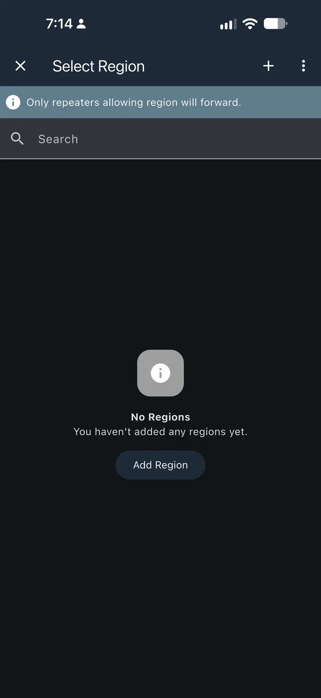{ loading=lazy width="600" height="1304" }](../assets/images/onqc-scopes/companion-03-select-region.webp)
<figcaption markdown="span"><span class="scp-shot__num">3</span> If <code>onqc</code> is not listed, tap <strong>Add Region</strong>, or the <strong>+</strong> at the top right.</figcaption>
</figure>

<figure class="scp-shot" markdown>
[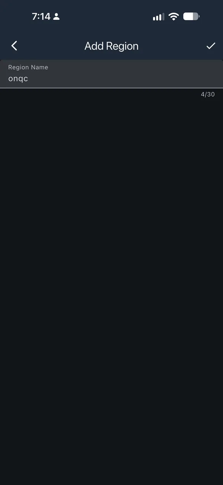{ loading=lazy width="600" height="1304" }](../assets/images/onqc-scopes/companion-04-add-region.webp)
<figcaption markdown="span"><span class="scp-shot__num">4</span> Type <code>onqc</code>, all lowercase, and tap the <strong>checkmark</strong> in the top right.</figcaption>
</figure>

<figure class="scp-shot" markdown>
[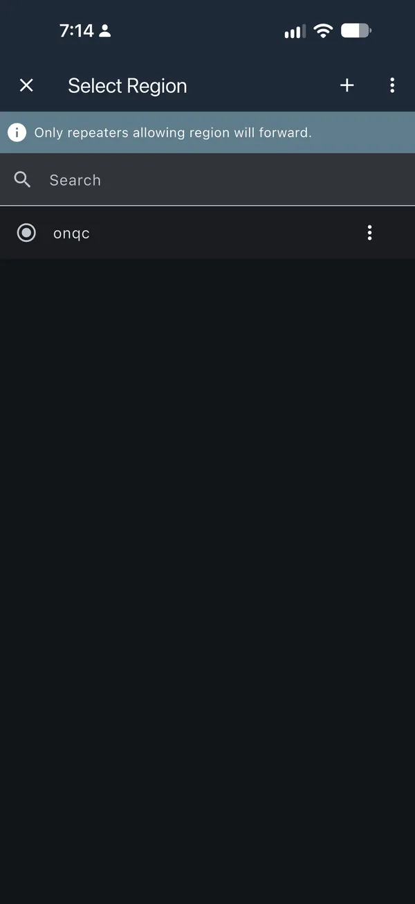{ loading=lazy width="600" height="1304" }](../assets/images/onqc-scopes/companion-05-pick-onqc.webp)
<figcaption markdown="span"><span class="scp-shot__num">5</span> Tap <code>onqc</code> to select it.</figcaption>
</figure>

<figure class="scp-shot" markdown>
[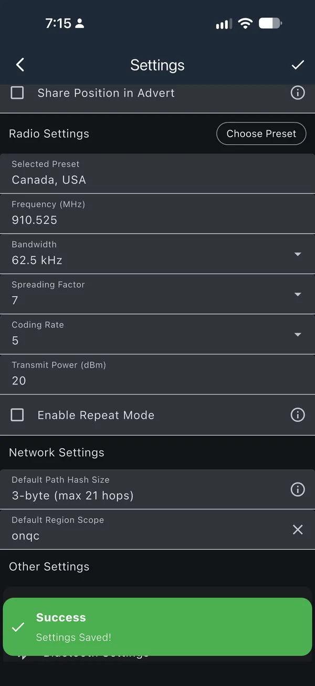{ loading=lazy width="600" height="1304" }](../assets/images/onqc-scopes/companion-06-saved.webp)
<figcaption markdown="span"><span class="scp-shot__num">6</span> Default Region Scope now shows <code>onqc</code>. Tap the <strong>checkmark</strong> in the top right. It spins while saving, then <strong>Settings Saved!</strong> pops up.</figcaption>
</figure>

</div>

### Step 2: Set a scope on each channel

Open the channel, tap **⋮** in the top right, choose **Set Region Scope**,
and pick the scope from this table:

| Channel | Scope | Why |
| --- | --- | --- |
| `Public` | `onqc` | Everyone in Ontario and Québec can talk |
| Test channels, such as `#testing` | Your city, for example `yow` | Tests stay local |
| Bot channels, such as `#bots` | Your city, for example `yow` | Bot replies stay local |
| Your own channels | Your city, `on`/`qc`, or `onqc` | Pick how far it should reach |

If you run a bot, it should already be on your city from
[Phase 1](#bots-and-meshmapper).

**Example: `Public` to `onqc`**

<div class="scp-shots" markdown>

<figure class="scp-shot" markdown>
[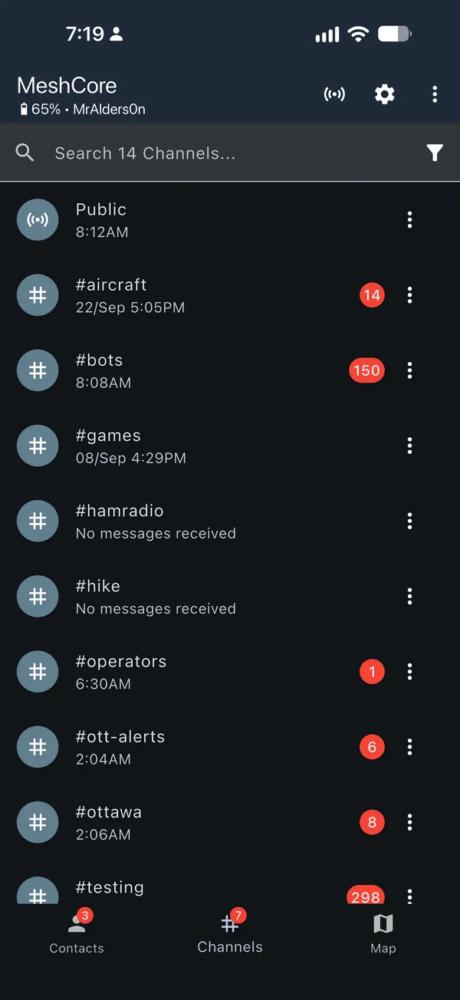{ loading=lazy width="600" height="1304" }](../assets/images/onqc-scopes/companion-07-channels.webp)
<figcaption markdown="span"><span class="scp-shot__num">1</span> Tap <strong>Channels</strong> in the bottom menu bar and open <strong>Public</strong>.</figcaption>
</figure>

<figure class="scp-shot" markdown>
[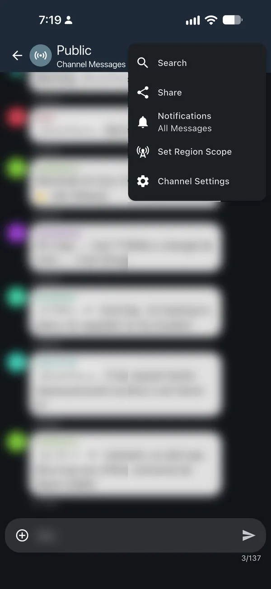{ loading=lazy width="600" height="1304" }](../assets/images/onqc-scopes/companion-09-channel-menu.webp)
<figcaption markdown="span"><span class="scp-shot__num">2</span> Tap <strong>⋮</strong> in the top right and choose <strong>Set Region Scope</strong>.</figcaption>
</figure>

<figure class="scp-shot" markdown>
[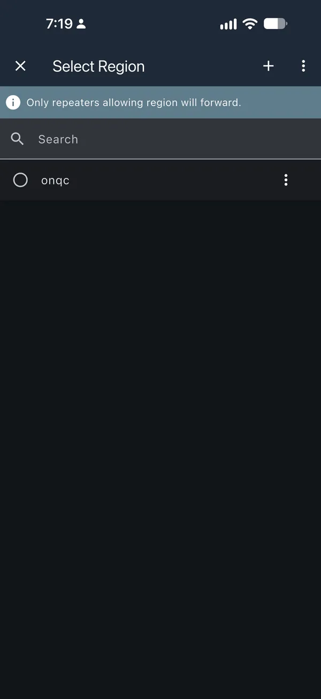{ loading=lazy width="600" height="1304" }](../assets/images/onqc-scopes/companion-10-public-pick-onqc.webp)
<figcaption markdown="span"><span class="scp-shot__num">3</span> Tap <code>onqc</code>.</figcaption>
</figure>

<figure class="scp-shot" markdown>
[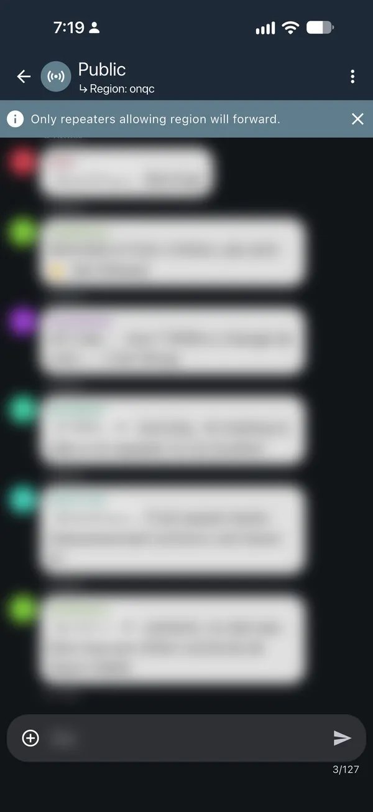{ loading=lazy width="600" height="1304" }](../assets/images/onqc-scopes/companion-11-public-scoped.webp)
<figcaption markdown="span"><span class="scp-shot__num">4</span> The header now shows <strong>Region: onqc</strong>, and a banner says only repeaters allowing that region will forward. The limit drops to 127 characters.</figcaption>
</figure>

</div>

<div class="mc-callout" markdown>
**Scoped messages are a little shorter.** Once a channel has a scope, the app
allows fewer characters per message. In our testing, the limit on `Public`
dropped from 137 to 127 characters after setting it to `onqc`. The app sets
the exact limit, and it can vary with your node name and app version.
</div>

**Example: `#testing` to your city**

<div class="scp-shots" markdown>

<figure class="scp-shot" markdown>
[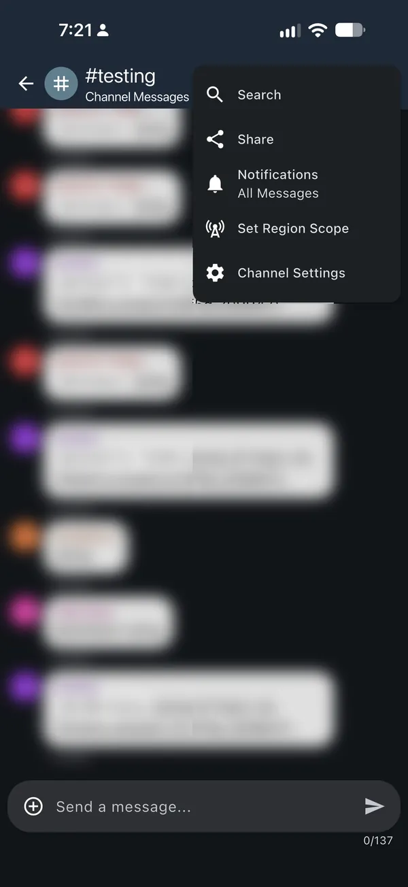{ loading=lazy width="600" height="1304" }](../assets/images/onqc-scopes/companion-13-testing-menu.webp)
<figcaption markdown="span"><span class="scp-shot__num">1</span> Open the channel, tap <strong>⋮</strong> and choose <strong>Set Region Scope</strong>.</figcaption>
</figure>

<figure class="scp-shot" markdown>
[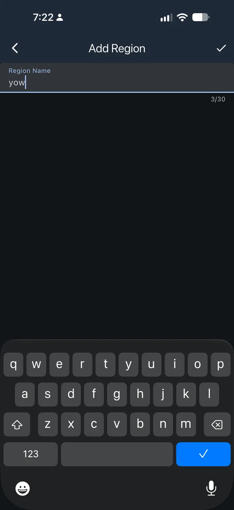{ loading=lazy width="600" height="1304" }](../assets/images/onqc-scopes/companion-15-add-yow.webp)
<figcaption markdown="span"><span class="scp-shot__num">2</span> If your city code is not listed, tap <strong>+</strong>, type it (for example <code>yow</code>) and tap the <strong>checkmark</strong>.</figcaption>
</figure>

<figure class="scp-shot" markdown>
[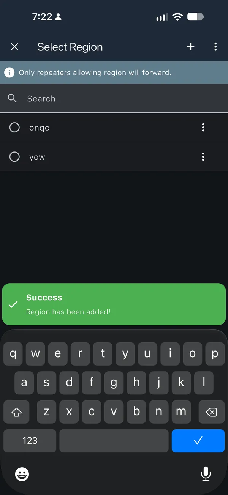{ loading=lazy width="600" height="1304" }](../assets/images/onqc-scopes/companion-16-yow-added.webp)
<figcaption markdown="span"><span class="scp-shot__num">3</span> <strong>Region has been added!</strong> Tap your city code to select it.</figcaption>
</figure>

<figure class="scp-shot" markdown>
[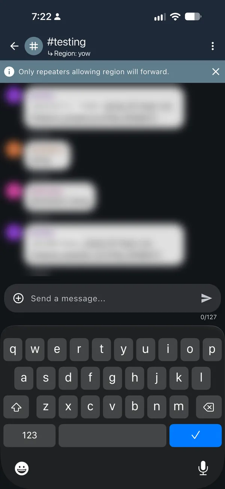{ loading=lazy width="600" height="1304" }](../assets/images/onqc-scopes/companion-17-testing-scoped.webp)
<figcaption markdown="span"><span class="scp-shot__num">4</span> The header now shows <strong>Region: yow</strong>.</figcaption>
</figure>

</div>

### Why the companion default is `onqc`

<details class="scp-more" markdown>
<summary>Show the explanation</summary>

You cannot pick a scope for a single direct message. When a DM has no known
path yet, it floods using your **default scope**. The reply that tells your
companion the path comes back using **your contact's** default scope.

<figure class="scp-figure">
  <div class="scp-route">
    <div class="scp-route__head">Companion default <span class="scp-tag" data-level="city">yow</span><span class="scp-route__verdict" data-result="drop">Never arrives</span></div>
    <ol class="scp-track">
      <li><span class="scp-stop" data-kind="phone"><svg viewBox="0 0 24 24" fill="none" stroke="currentColor" stroke-width="1.8" stroke-linecap="round" aria-hidden="true"><rect x="7" y="2.5" width="10" height="19" rx="2"/><path d="M11 18.5h2"/></svg></span><strong>You, Ottawa</strong><small>sends yow</small></li>
      <li data-link="ok"><span class="scp-stop" data-kind="repeater"><svg viewBox="0 0 24 24" fill="none" stroke="currentColor" stroke-width="1.8" stroke-linecap="round" stroke-linejoin="round" aria-hidden="true"><path d="M12 10v11M8 21h8M9.5 21 12 10l2.5 11"/><circle cx="12" cy="8" r="1.6"/><path d="M8.6 4.6a5 5 0 0 0 0 6.8M15.4 4.6a5 5 0 0 1 0 6.8"/></svg></span><strong>Ottawa repeater</strong><small>yow on onqc can</small></li>
      <li data-link="drop"><span class="scp-stop" data-kind="repeater" data-state="dim"><svg viewBox="0 0 24 24" fill="none" stroke="currentColor" stroke-width="1.8" stroke-linecap="round" stroke-linejoin="round" aria-hidden="true"><path d="M12 10v11M8 21h8M9.5 21 12 10l2.5 11"/><circle cx="12" cy="8" r="1.6"/><path d="M8.6 4.6a5 5 0 0 0 0 6.8M15.4 4.6a5 5 0 0 1 0 6.8"/></svg></span><strong>Montréal repeater</strong><small>yul qc onqc can</small></li>
      <li data-link="none"><span class="scp-stop" data-kind="repeater" data-state="dim"><svg viewBox="0 0 24 24" fill="none" stroke="currentColor" stroke-width="1.8" stroke-linecap="round" stroke-linejoin="round" aria-hidden="true"><path d="M12 10v11M8 21h8M9.5 21 12 10l2.5 11"/><circle cx="12" cy="8" r="1.6"/><path d="M8.6 4.6a5 5 0 0 0 0 6.8M15.4 4.6a5 5 0 0 1 0 6.8"/></svg></span><strong>Québec repeater</strong><small>yqb qc onqc can</small></li>
      <li data-link="none"><span class="scp-stop" data-kind="phone" data-state="dim"><svg viewBox="0 0 24 24" fill="none" stroke="currentColor" stroke-width="1.8" stroke-linecap="round" aria-hidden="true"><rect x="7" y="2.5" width="10" height="19" rx="2"/><path d="M11 18.5h2"/></svg></span><strong>Friend, Québec City</strong><small>default yqb</small></li>
    </ol>
    <p class="scp-route__note">The Montréal repeater does not carry <code>yow</code>, so the message stops there. Even if it got through, your friend's reply would use <code>yqb</code> and stop on the way back.</p>
  </div>
  <div class="scp-route">
    <div class="scp-route__head">Companion default <span class="scp-tag" data-level="mesh">onqc</span><span class="scp-route__verdict" data-result="ok">Delivered</span></div>
    <ol class="scp-track" data-animate>
      <li><span class="scp-stop" data-kind="phone"><svg viewBox="0 0 24 24" fill="none" stroke="currentColor" stroke-width="1.8" stroke-linecap="round" aria-hidden="true"><rect x="7" y="2.5" width="10" height="19" rx="2"/><path d="M11 18.5h2"/></svg></span><strong>You, Ottawa</strong><small>sends onqc</small></li>
      <li data-link="ok"><span class="scp-stop" data-kind="repeater"><svg viewBox="0 0 24 24" fill="none" stroke="currentColor" stroke-width="1.8" stroke-linecap="round" stroke-linejoin="round" aria-hidden="true"><path d="M12 10v11M8 21h8M9.5 21 12 10l2.5 11"/><circle cx="12" cy="8" r="1.6"/><path d="M8.6 4.6a5 5 0 0 0 0 6.8M15.4 4.6a5 5 0 0 1 0 6.8"/></svg></span><strong>Ottawa repeater</strong><small>yow on onqc can</small></li>
      <li data-link="ok"><span class="scp-stop" data-kind="repeater"><svg viewBox="0 0 24 24" fill="none" stroke="currentColor" stroke-width="1.8" stroke-linecap="round" stroke-linejoin="round" aria-hidden="true"><path d="M12 10v11M8 21h8M9.5 21 12 10l2.5 11"/><circle cx="12" cy="8" r="1.6"/><path d="M8.6 4.6a5 5 0 0 0 0 6.8M15.4 4.6a5 5 0 0 1 0 6.8"/></svg></span><strong>Montréal repeater</strong><small>yul qc onqc can</small></li>
      <li data-link="ok"><span class="scp-stop" data-kind="repeater"><svg viewBox="0 0 24 24" fill="none" stroke="currentColor" stroke-width="1.8" stroke-linecap="round" stroke-linejoin="round" aria-hidden="true"><path d="M12 10v11M8 21h8M9.5 21 12 10l2.5 11"/><circle cx="12" cy="8" r="1.6"/><path d="M8.6 4.6a5 5 0 0 0 0 6.8M15.4 4.6a5 5 0 0 1 0 6.8"/></svg></span><strong>Québec repeater</strong><small>yqb qc onqc can</small></li>
      <li data-link="ok"><span class="scp-stop" data-kind="phone"><svg viewBox="0 0 24 24" fill="none" stroke="currentColor" stroke-width="1.8" stroke-linecap="round" aria-hidden="true"><rect x="7" y="2.5" width="10" height="19" rx="2"/><path d="M11 18.5h2"/></svg></span><strong>Friend, Québec City</strong><small>default onqc</small></li>
    </ol>
    <p class="scp-route__note">Every repeater carries <code>onqc</code>, in both directions. Once the path is found, later DMs go direct and scopes no longer matter.</p>
  </div>
  <figcaption>Logins to a repeater or room server work the same way when no path is known.</figcaption>
</figure>

<div class="mc-callout" data-kind="warning" markdown>
**The catch:** a channel with no scope of its own also uses your default,
`onqc`, so it reaches all of Ontario and Québec. That is what we want for
`Public`, but not for test channels and bots. That is why step 2 of the
companion setup sets those to your city.
</div>

</details>


## Phase 3: Only if needed

If messages with no scope are still too noisy inside a city after Phase 2,
repeaters can also run `set flood.max.unscoped 3`, then `region save`.
Messages with no scope then stop after 3 hops. Scoped messages still reach
16 hops. Only do this once it is announced for your city.

## Who hears what

<details class="scp-more" markdown>
<summary>Show the examples</summary>

With edge repeaters dropping messages with no scope, a new user who hasn't set
a scope yet still reaches everyone in their own city. Their messages just
don't cross into the next city. Here is the Ottawa to Montréal link through
Rigaud, an edge repeater that also carries Montréal's code, `yul`.

<figure class="scp-figure">
  <div class="scp-route">
    <div class="scp-route__head">New user in Ottawa, no scope <span class="scp-tag" data-level="any">none</span><span class="scp-route__verdict" data-result="ok">Whole Ottawa area</span></div>
    <ol class="scp-track">
      <li><span class="scp-stop" data-kind="phone"><svg viewBox="0 0 24 24" fill="none" stroke="currentColor" stroke-width="1.8" stroke-linecap="round" aria-hidden="true"><rect x="7" y="2.5" width="10" height="19" rx="2"/><path d="M11 18.5h2"/></svg></span><strong>New user, Ottawa</strong><small>no scope</small></li>
      <li data-link="ok"><span class="scp-stop" data-kind="repeater"><svg viewBox="0 0 24 24" fill="none" stroke="currentColor" stroke-width="1.8" stroke-linecap="round" stroke-linejoin="round" aria-hidden="true"><path d="M12 10v11M8 21h8M9.5 21 12 10l2.5 11"/><circle cx="12" cy="8" r="1.6"/><path d="M8.6 4.6a5 5 0 0 0 0 6.8M15.4 4.6a5 5 0 0 1 0 6.8"/></svg></span><strong>Ottawa repeater</strong><small>allows *</small></li>
      <li data-link="ok"><span class="scp-stop" data-kind="repeater"><svg viewBox="0 0 24 24" fill="none" stroke="currentColor" stroke-width="1.8" stroke-linecap="round" stroke-linejoin="round" aria-hidden="true"><path d="M12 10v11M8 21h8M9.5 21 12 10l2.5 11"/><circle cx="12" cy="8" r="1.6"/><path d="M8.6 4.6a5 5 0 0 0 0 6.8M15.4 4.6a5 5 0 0 1 0 6.8"/></svg></span><strong>Rigaud edge repeater</strong><small>drops *</small></li>
      <li data-link="drop"><span class="scp-stop" data-kind="repeater" data-state="dim"><svg viewBox="0 0 24 24" fill="none" stroke="currentColor" stroke-width="1.8" stroke-linecap="round" stroke-linejoin="round" aria-hidden="true"><path d="M12 10v11M8 21h8M9.5 21 12 10l2.5 11"/><circle cx="12" cy="8" r="1.6"/><path d="M8.6 4.6a5 5 0 0 0 0 6.8M15.4 4.6a5 5 0 0 1 0 6.8"/></svg></span><strong>Montréal repeater</strong><small>allows *</small></li>
      <li data-link="none"><span class="scp-stop" data-kind="phone" data-state="dim"><svg viewBox="0 0 24 24" fill="none" stroke="currentColor" stroke-width="1.8" stroke-linecap="round" aria-hidden="true"><rect x="7" y="2.5" width="10" height="19" rx="2"/><path d="M11 18.5h2"/></svg></span><strong>Montréal user</strong><small>never sees it</small></li>
    </ol>
    <p class="scp-route__note">Every Ottawa-zone repeater passes it on, so the new user reaches the whole Ottawa area. Rigaud hears it but does not pass it on, so Montréal is never flooded.</p>
  </div>
  <div class="scp-route">
    <div class="scp-route__head">Ottawa bot or MeshMapper, scoped <span class="scp-tag" data-level="city">yow</span><span class="scp-route__verdict" data-result="ok">Ottawa zone only</span></div>
    <ol class="scp-track">
      <li><span class="scp-stop" data-kind="phone"><svg viewBox="0 0 24 24" fill="none" stroke="currentColor" stroke-width="1.8" stroke-linecap="round" aria-hidden="true"><rect x="7" y="2.5" width="10" height="19" rx="2"/><path d="M11 18.5h2"/></svg></span><strong>Bot, Ottawa</strong><small>sends yow</small></li>
      <li data-link="ok"><span class="scp-stop" data-kind="repeater"><svg viewBox="0 0 24 24" fill="none" stroke="currentColor" stroke-width="1.8" stroke-linecap="round" stroke-linejoin="round" aria-hidden="true"><path d="M12 10v11M8 21h8M9.5 21 12 10l2.5 11"/><circle cx="12" cy="8" r="1.6"/><path d="M8.6 4.6a5 5 0 0 0 0 6.8M15.4 4.6a5 5 0 0 1 0 6.8"/></svg></span><strong>Ottawa repeater</strong><small>yow on onqc can</small></li>
      <li data-link="ok"><span class="scp-stop" data-kind="repeater"><svg viewBox="0 0 24 24" fill="none" stroke="currentColor" stroke-width="1.8" stroke-linecap="round" stroke-linejoin="round" aria-hidden="true"><path d="M12 10v11M8 21h8M9.5 21 12 10l2.5 11"/><circle cx="12" cy="8" r="1.6"/><path d="M8.6 4.6a5 5 0 0 0 0 6.8M15.4 4.6a5 5 0 0 1 0 6.8"/></svg></span><strong>Rigaud edge repeater</strong><small>yow yul qc onqc can</small></li>
      <li data-link="drop"><span class="scp-stop" data-kind="repeater" data-state="dim"><svg viewBox="0 0 24 24" fill="none" stroke="currentColor" stroke-width="1.8" stroke-linecap="round" stroke-linejoin="round" aria-hidden="true"><path d="M12 10v11M8 21h8M9.5 21 12 10l2.5 11"/><circle cx="12" cy="8" r="1.6"/><path d="M8.6 4.6a5 5 0 0 0 0 6.8M15.4 4.6a5 5 0 0 1 0 6.8"/></svg></span><strong>Montréal repeater</strong><small>yul qc onqc can</small></li>
      <li data-link="none"><span class="scp-stop" data-kind="phone" data-state="dim"><svg viewBox="0 0 24 24" fill="none" stroke="currentColor" stroke-width="1.8" stroke-linecap="round" aria-hidden="true"><rect x="7" y="2.5" width="10" height="19" rx="2"/><path d="M11 18.5h2"/></svg></span><strong>Montréal user</strong><small>never sees it</small></li>
    </ol>
    <p class="scp-route__note">Rigaud carries <code>yow</code>, so it passes the message on. Montréal repeaters do not carry <code>yow</code>, so it stops at the edge of the zone.</p>
  </div>
  <div class="scp-route">
    <div class="scp-route__head">DM with the companion default <span class="scp-tag" data-level="mesh">onqc</span><span class="scp-route__verdict" data-result="ok">Whole mesh</span></div>
    <ol class="scp-track" data-animate>
      <li><span class="scp-stop" data-kind="phone"><svg viewBox="0 0 24 24" fill="none" stroke="currentColor" stroke-width="1.8" stroke-linecap="round" aria-hidden="true"><rect x="7" y="2.5" width="10" height="19" rx="2"/><path d="M11 18.5h2"/></svg></span><strong>You, Ottawa</strong><small>sends onqc</small></li>
      <li data-link="ok"><span class="scp-stop" data-kind="repeater"><svg viewBox="0 0 24 24" fill="none" stroke="currentColor" stroke-width="1.8" stroke-linecap="round" stroke-linejoin="round" aria-hidden="true"><path d="M12 10v11M8 21h8M9.5 21 12 10l2.5 11"/><circle cx="12" cy="8" r="1.6"/><path d="M8.6 4.6a5 5 0 0 0 0 6.8M15.4 4.6a5 5 0 0 1 0 6.8"/></svg></span><strong>Ottawa repeater</strong><small>yow on onqc can</small></li>
      <li data-link="ok"><span class="scp-stop" data-kind="repeater"><svg viewBox="0 0 24 24" fill="none" stroke="currentColor" stroke-width="1.8" stroke-linecap="round" stroke-linejoin="round" aria-hidden="true"><path d="M12 10v11M8 21h8M9.5 21 12 10l2.5 11"/><circle cx="12" cy="8" r="1.6"/><path d="M8.6 4.6a5 5 0 0 0 0 6.8M15.4 4.6a5 5 0 0 1 0 6.8"/></svg></span><strong>Rigaud edge repeater</strong><small>yow yul qc onqc can</small></li>
      <li data-link="ok"><span class="scp-stop" data-kind="repeater"><svg viewBox="0 0 24 24" fill="none" stroke="currentColor" stroke-width="1.8" stroke-linecap="round" stroke-linejoin="round" aria-hidden="true"><path d="M12 10v11M8 21h8M9.5 21 12 10l2.5 11"/><circle cx="12" cy="8" r="1.6"/><path d="M8.6 4.6a5 5 0 0 0 0 6.8M15.4 4.6a5 5 0 0 1 0 6.8"/></svg></span><strong>Montréal repeater</strong><small>yul qc onqc can</small></li>
      <li data-link="ok"><span class="scp-stop" data-kind="phone"><svg viewBox="0 0 24 24" fill="none" stroke="currentColor" stroke-width="1.8" stroke-linecap="round" aria-hidden="true"><rect x="7" y="2.5" width="10" height="19" rx="2"/><path d="M11 18.5h2"/></svg></span><strong>Friend, Montréal</strong><small>default onqc</small></li>
    </ol>
    <p class="scp-route__note">Every repeater carries <code>onqc</code>, including the edge repeater, so DMs still cross the whole mesh.</p>
  </div>
  <figcaption>The same thing happens at every edge between two cities.</figcaption>
</figure>

More examples on the same link:

| Message | Ottawa repeaters<br>`* yow on onqc can` | Rigaud edge repeater<br>`yow yul qc onqc can` | Montréal repeaters<br>`* yul qc onqc can` | Who gets it |
| --- | --- | --- | --- | --- |
| New user in Ottawa, no scope | ✅ Forward | ❌ Drop | Never reached | Whole Ottawa area |
| New user in Montréal, no scope | Never reached | ❌ Drop | ✅ Forward | Whole Montréal area |
| Ottawa channel or bot, `yow` | ✅ Forward | ✅ Forward | ❌ Drop | Ottawa zone only |
| Montréal channel or bot, `yul` | ❌ Drop | ✅ Forward | ✅ Forward | Montréal zone only |
| Québec-wide channel, `qc` | ❌ Drop | ✅ Forward | ✅ Forward | Québec side, including Gatineau |
| DM with the companion default, `onqc` | ✅ Forward | ✅ Forward | ✅ Forward | Whole ON/QC mesh |

This is why bots and MeshMapper should be scoped to their city: they stay
contained no matter what, and new users who haven't set a scope yet still work
locally.

</details>


## Things to know

- **Scoped messages are about 10 characters shorter.** The app lowers the
  message length limit on scoped channels (137 to 127 in our testing).
- **Repeater adverts stay in their city.** Montréal users will not see Ottawa
  repeaters through flood adverts.
- **16 hops has to be enough.** `flood.max` applies to `onqc` too. If the
  longest real path across the mesh is longer than 16 hops, cross-mesh
  messages will stop part way.
- **Versions:** `region def` needs repeater firmware 1.16 or newer. Default
  scope in the app needs MeshCore 1.43 or newer.

## Next steps

- Check your published MeshMapper code in the [IATA region map](../config/map.md).
- Use the [migration guide](../config/standard.md) and [repeater configurator](../config/index.md) for clean-up and firmware-specific commands.
- Coordinate and test the ON/QC rollout with local operators before changing deployed repeaters.
- The website now offers IATA zones across Canada. This is not a nationwide rollout of `onqc`: that scope and the pilot settings remain specific to Ontario and Québec. Other provinces coordinate their own migration.

Have thoughts? Share them on the
[MeshCore Canada Discord](https://discord.gg/BESFVMt7yk) or the
[forum](https://forum.meshcore.ca/).
